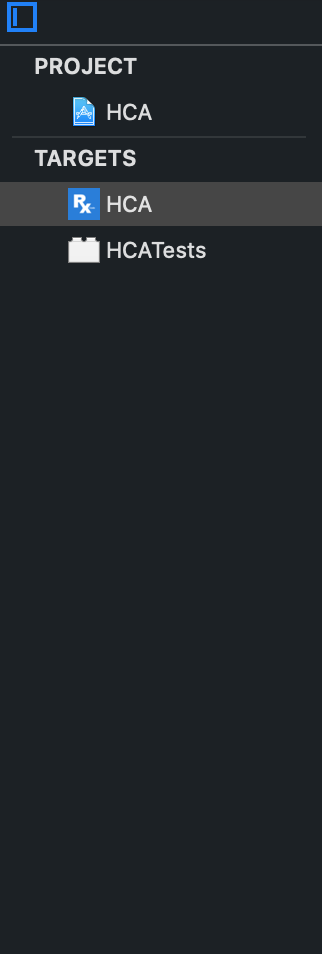
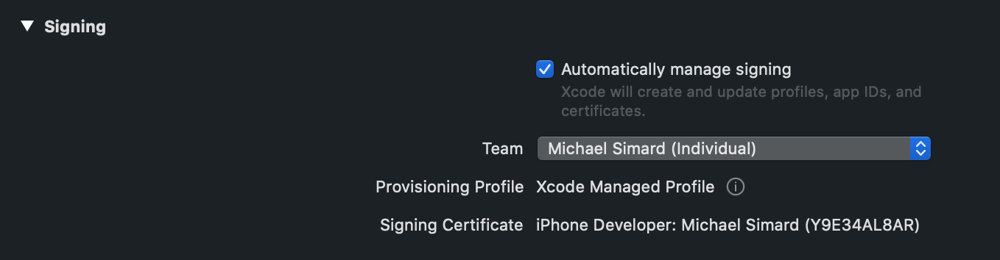
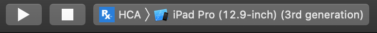

# RXCode
## Overview
This app shows an infinite scrollable list  (actually capped at around 300 items to prevent API abuse) of recent StackOverflow questions that have at least 2 answers where one of them has been selected by the community. 
## Support
This app supports both iPad and iPhone in all orientations running iOS 12+.  The behavior is a bit different on iPad and the larger iPhone’s because the UISplitController layout.  
## Details
* Images are cached in memory the app to prevent unneeded downloads. 
* StackOverflow’s API is flexible enough to where I only needed to pull down the data I needed.  Questions that have more than one answer and a selected answer are determined by the server and returned to me based on the filter I give them. 
* Questions are sorted by the time they are asked. 
* The selected answer is always the first answer.  This is the only area where I needed to a client side sort/filter.
* On iPad’s you can see a basic UIAnimation over the logo after launching the app.
* The answers and questions use Attirbuted Label’s generated from HTML so code blocks stand out.  
## Installation
1. Pull the code from GitHub
2. If you want to build to a device, pick a valid signing profile.  Select the project file, then select HCA under Targets.  You can change the signing profile under the General tab in the signing section.

3. Select your device (simulator or real device) and hit the play button to run 

Let me know if you have any questions
